# __**Ansible en Google Cloud**__


## ¿Qué es Google Cloud? ☁
  

Google Cloud es el espacio virtual a través del cual se puede realizar una serie de tareas que antes requerían de hardware o software y que ahora utilizan la nube de Google como única forma de acceso, almacenamiento y gestión de datos.

## ¿Qué son las Instancias de VM? 
Son un servicio de Googe Cloud que permite a los usuarios el alquiler máquinas virtuales de tamaño modificable para ejecutar sus aplicaciones informáticas. Permite pagar únicamente por la capacidad utilizada, en lugar de comprar o alquilar una máquina para utilizarla durante varios meses o años, con Google se alquila la capacidad por horas.

## Creación de Instancias de VM 🔧
1. Una vez registrados accederemos al Inicio del Panel de Control de Google Cloud.  


2. En el panel de navegación situado a la izquierda seleccionamos **Compute Engine > Instancias de VM**.

3.	Pulsamos en el panel superior en **Crear Instancia**.  

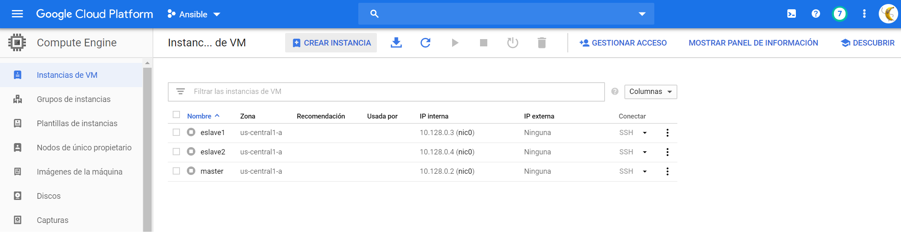

4.	En Nombre le asignamos un nombre a nuestra instancia.  


5.	En Disco de arranque seleccionamos la imagen que queramos para nuestra máquina, en nuestro caso será Ubuntu 18.04 LTS.

6.	En Cortafuegos es donde abriremos los puertos para conectarnos a esa máquina. Aquí Google nos lo pone fácil y nos da la opción de marcar las casillas de http y https, también deberemos de añadir ssh.

7.	Finalmente pulsamos en **Crear** y esperamos que se inicie nuestra instancia.  

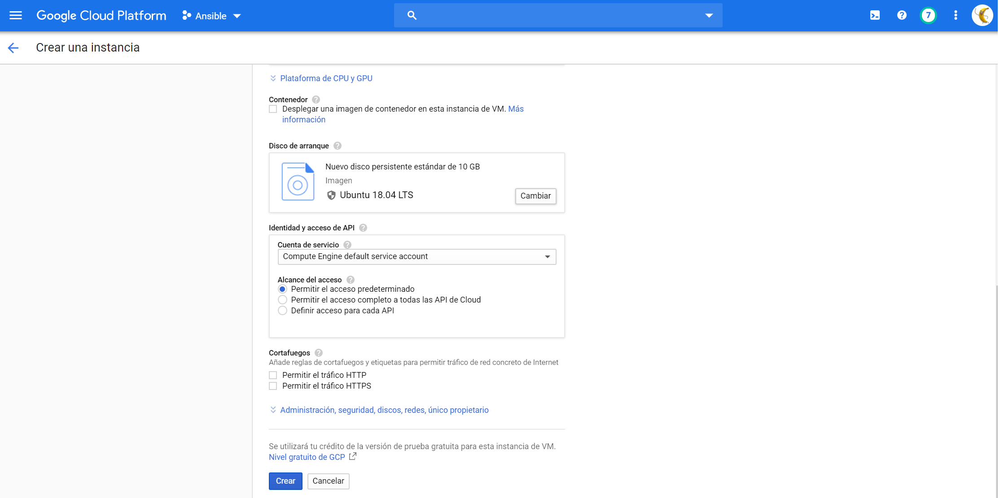

## Gestión de claves SSH 🔒

1.	Ahora necesitamos configurar el nodo principal (master) para que pueda conectarse al resto de nodos por SSH. Para ello ejecutamos el comando **ssh-keygen** en la máquina master para crear una clave SSH pública y otra privada.

```
$ ssh-keygen

Generating public/private rsa key pair.
Enter file in which to save the key (/home/ubuntu/.ssh/id_rsa):
Enter passphrase (empty for no passphrase):
Enter same passphrase again:
Your identification has been saved in /home/ubuntu/.ssh/id_rsa.
Your public key has been saved in /home/ubuntu/.ssh/id_rsa.pub.
The key fingerprint is:
SHA256:j2ASXKcdWnUFUeerAktsj6E2Xs4uWmA3GcmCpBrp4oI ubuntu@ip-172-31-81-167
The key's randomart image is:
+---[RSA 2048]----+
|   .  . +.. +=o .|
| .o....*.. .   o |
|o. .o.o+.       .|
|o.   .. +       .|
|o.  .oo+S*     . |
|+   .oo.=o*   .  |
|E.     =.+.o .   |
|.     +.=   .    |
|     ...o+       |
+----[SHA256]-----+
```

2.	Una vez creada las claves SSH tenemos que copiar la clave pública en cada uno de los nodos que vamos a gestionar con Ansible.
En nuestro caso la clave pública está almacenada en la máquina principal en el directorio: */home/ubuntu/.ssh/id_rsa.pub*. 
Accedemos al directorio.

```
cd ~/.ssh/
```
Mostramos la clave y la copiamos.

```
cat id_rsa.pub
```

3.	Nos vamos a nuestra instancia que queremos conectar (eslave1) y pulsamos en EDITAR.  

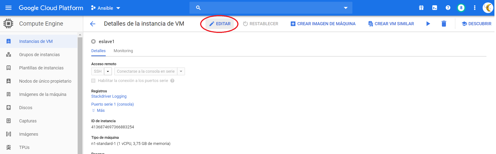

4.	En la sección Clave SSH insertamos la clave anterior y pulsamos en Guardar.  

 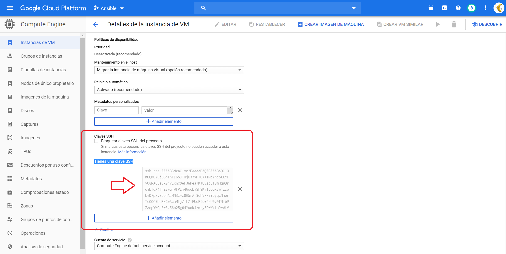

5.	Realizamos el mismo procedimiento para el resto de nodos.  

 ____
 ----

##	¿Qué es Ansible? 💻

<p align="center">
    
</p>

Ansible es una herramienta que nos permite configurar, administrar y realizar instalaciones en sistemas cloud con múltiples nodos sin tener que instalar agentes software en ellos. 
Sólo es necesario instalar Ansible en la máquina principal desde la que vamos a realizar operaciones sobre el resto de nodos y ésta se conectará a los nodos a través de SSH. Como requisito únicamente requiere Python en el servidor remoto en el que se vaya a ejecutar para poder utilizarlo.

💡💡***Dato curioso***💡💡  
El nombre de Ansible es usado en la literatura de ciencia ficción para describir un dispositivo de comunicación más rápido que la luz. Instantáneo.


##	Arquitectura de Ansible
Existen dos tipos de servidores:
- Controlador: es la máquina desde la que se llevan a cabo las órdenes.
- Nodo: es manejado por el controlador a través de SSH.

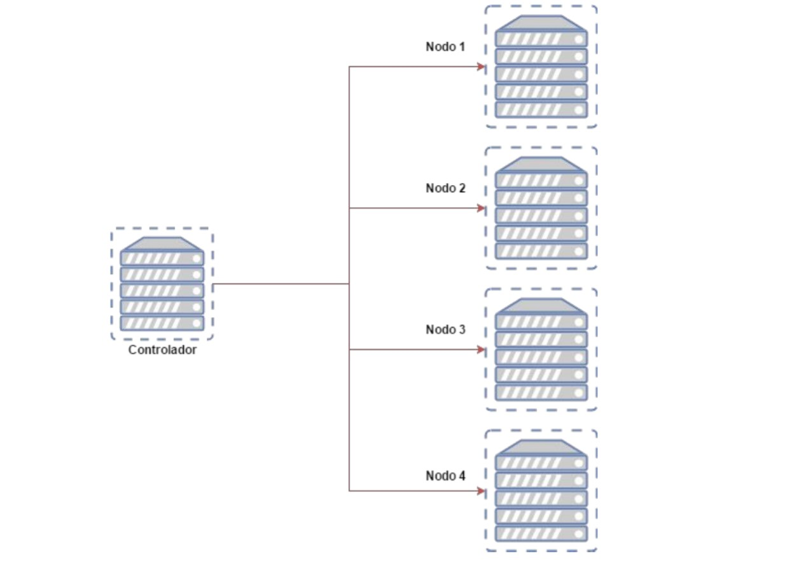

##	Instalación de Ansible 🛠️
La instalación de Ansible la vamos a realizar únicamente en el nodo principal y este nodo se conectará al resto de nodos por SSH para realizar las tareas de administración.
Una vez que nos hemos conectado al nodo principal podemos proceder a realizar la instalación de Ansible. El sistema operativo que de nuestra máquina es Ubuntu, por lo tanto, la instalación la realizaremos con apt.
```
$ sudo apt update
$ sudo apt install software-properties-common
$ sudo apt-add-repository --yes --update ppa:ansible/ansible
$ sudo apt install ansible
```
##	Configuración de Ansible ⚙️
De momento la única configuración que vamos a realizar en Ansible será editar el archivo de inventario /etc/ansible/hosts para incluir la lista de hosts sobre los que vamos a realizar tareas con Ansible.

Así, nuestro archivo ***/etc/ansible/hosts*** contendrá lo siguiente:

```
[googlehosts]
10.128.0.3
10.128.0.4
```
> En este caso las direcciones IP son internas, asi podemos parar y levantar las instancias cuantas veces queramos, ya que las IPS públicas cambian cada vez que las instancias se detienen. 

## Módulos de Ansible 🧩
Ansible dispone de una gran variedad de módulos que pueden ser utilizados desde la línea de comandos o en las tareas de los playbooks.

Existen módulos para trabajar con clouds (Amazon, Azure, etc.), clustering (Kubernetes, Openshift, etc.), bases de datos (Influxdb, Mongodb, MySQL, PostgreSQL, etc.), monitorización, mensajería, etc.

En la documentación oficial puede encontrar un listado de todos los módulos disponibles en [Ansible](https://docs.ansible.com/ansible/latest/modules/modules_by_category.html).

A continuación vamos a realizar una breve demostración de cómo utilizar los módulos:

- ping

- shell

- apt

- service

- Usuarios y Grupos

- Archivos y Directorios

- Crones


### Módulo *ping*
El módulo ping nos permite realizar un ping sobre todos los nodos del inventario o sobre algún nodo específico.

```
ansible all -m ping
```
Usamos el modificador -m para indicar a Ansible el módulo que queremos utilizar, y el modificador all para indicarle que queremos hacerlo sobre todos los nodos.  

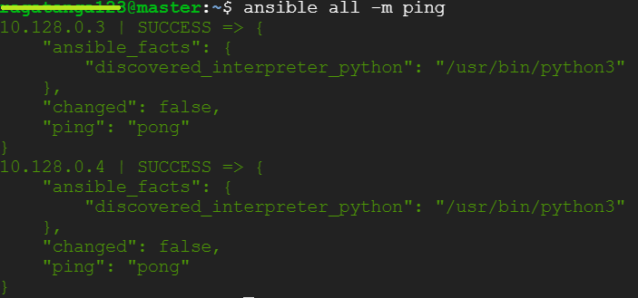

Si sólo queremos hacer ping sobre uno de los nodos en lugar de usar all, indicaremos el nodo sobre el que queremos realizar la operación.

```
ansible 10.128.0.3 -m ping
```  

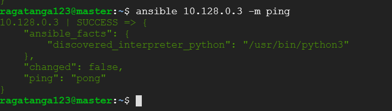

### Módulo *shell*
Si no indicamos nigún módulo, por defecto Ansible utilizará el módulo shell, el cual nos permite ejecutar comandos sobre cada uno de los nodos.

El siguiente ejemplo ejecuta el comando uname -a sobre todos los nodos del inventario.

```
ansible all -m shell -a "uname -a"
```
En este caso el modificador -m nos permite indicar el módulo que queremos utilizar y el modificador -a nos permite indicar el comando.  

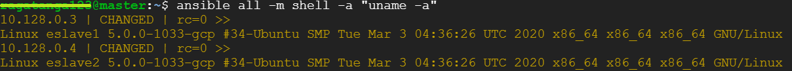

### Módulo *apt*
El módulo apt nos permite utilizar el sistema de gestión de paquetes APT para los sistemas operativos Debian y Ubuntu.

En la [documentación oficial](https://docs.ansible.com/ansible/latest/modules/apt_module.html#apt-module) tenemos disponible todos los parámetros que podemos usar es este módulo.

Por ejemplo, el parámetro update_cache nos permite realizar la operación apt-get update. Si quisiéramos realizar un *apt-get update* sobre cada uno de los nodos ejecutaríamos el siguiente comando.

```
ansible all -m apt -a "update_cache=yes" -b
```  

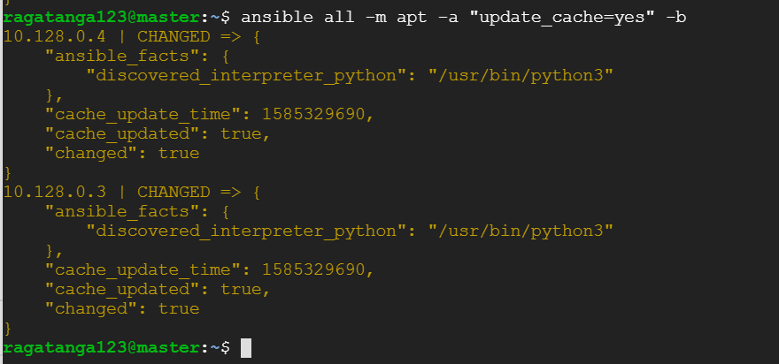

> El modificador -b es para indicar que queremos realizar un escalado de privilegios (become) para poder ejecutar comandos como root.  

Para poder realizar la instalación de un paquete será necesario hacer uso de los parámetros *name* y *state*:

- El parámetro *name* nos permite indicar el nombre del paquete que queremos instalar.
- El parámetro *state* nos permite indicar en qué estado queremos que se encuentre el paquete. En este caso vamos a indicar present, para indicar que queremos que esté instalado.

Ejemplo de cómo instalar git en cada uno de los nodos.

```
ansible all -m apt -a "name=git state=present" -b
```

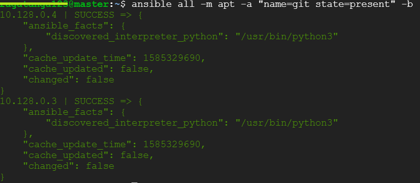

### Módulo *service*
El módulo service nos permite activar o desactivar servicios sobre cada uno de los nodos.

El siguiente ejemplo activa el servicio de apache2 sobre todos los nodos del inventario.

```
ansible all -m service -a "name=apache2 state=started"
```
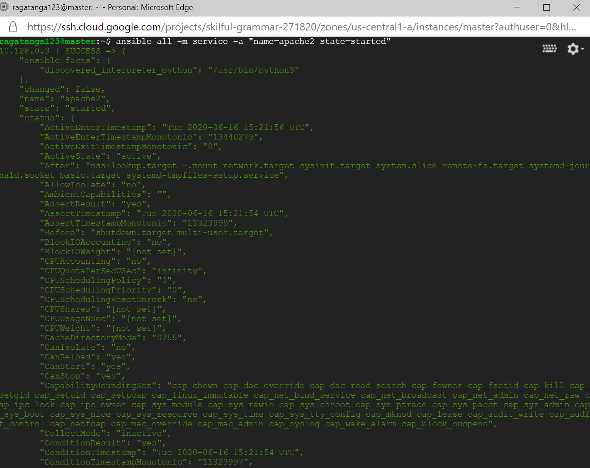

Y con el siguiente comando comprobamos que el servicio esta activo:

```
ansible all -a "service apache2 status"
```
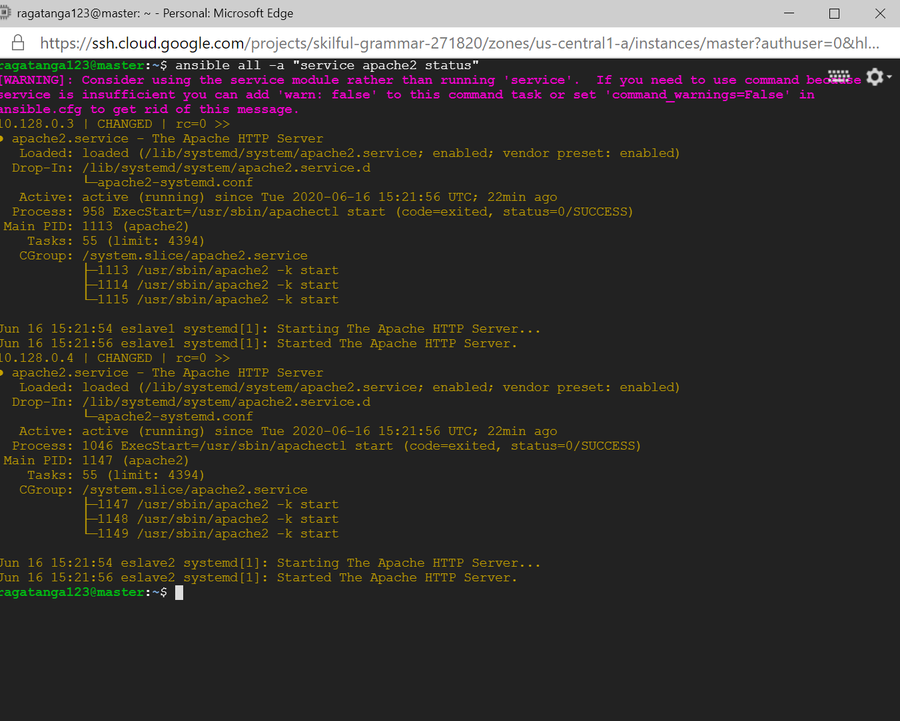


### Módulos *Usuarios y Grupos*

Los módulos de Ansible hacen muy sencilla la gestión de usuarios y grupos. Por ejemplo, si quisiéramos añadir un grupo admin:


```
ansible all -m group -a "name=admin state=present" -b
```
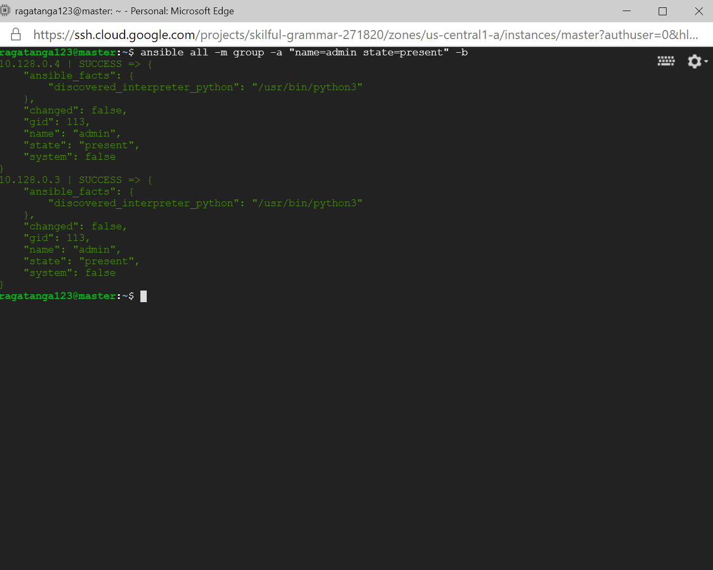

El módulo de grupos es muy sencillo. Se puede eliminar un grupo con state=absent o indicar si es un grupo de sistema con system=yes.

Para añadir un usuario llamado jose al grupo que acabamos de añadir y crear su carpeta /home/jose, introducimos el siguiente comando:

```
ansible all -m user -a "name=jose group=admin createhome=yes" -b
```
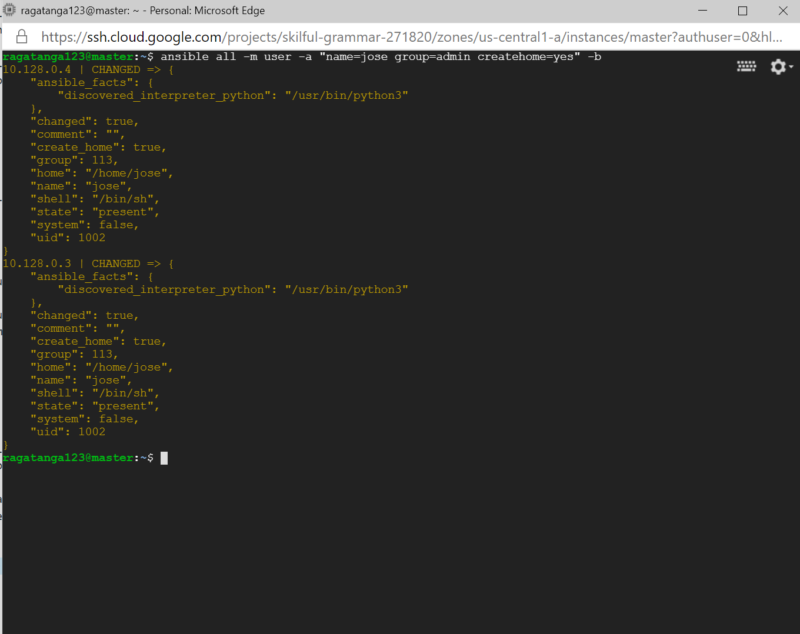


### Módulos *Archivos y Directorios*

*Obtener información de un archivo*

Si queremos obtener información sobre permisos o diferentes propiedades de un archivo, tenemos que utilizar el módulo stat:

```
ansible all -m stat -a "path=/etc/hosts"
```
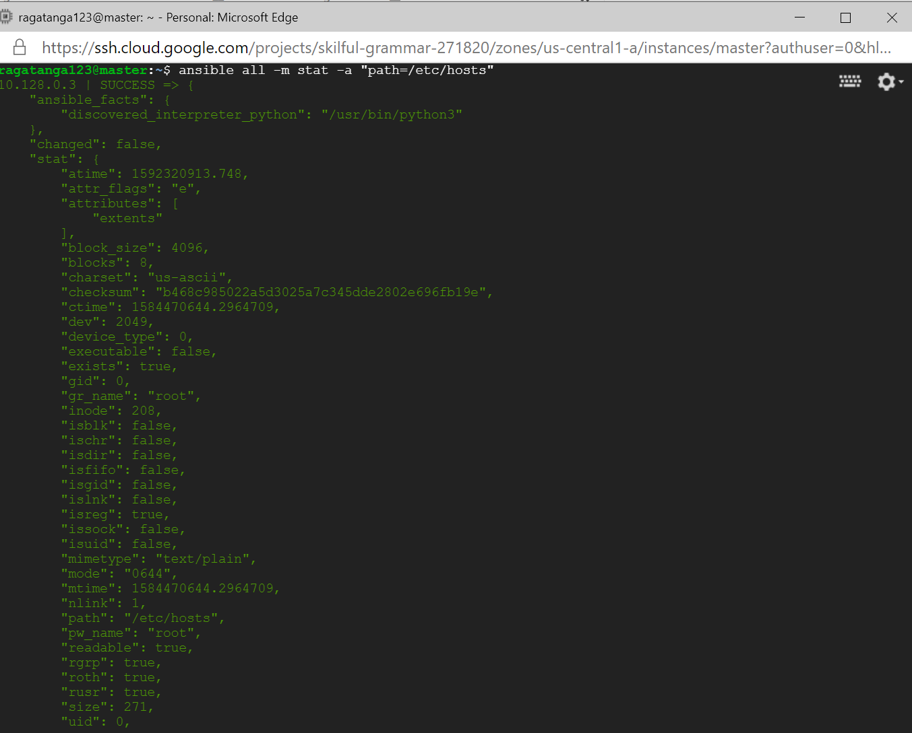

*Copiar un archivo a los servidores*

El parámetro src puede ser un archivo o un directorio completo. Si incluimos una barra ‘/’ al final, solo los contenidos del directorio se copiaran al destino. 

```
ansible all -m copy -a "src=/etc/hosts dest=/tmp/hosts"
```
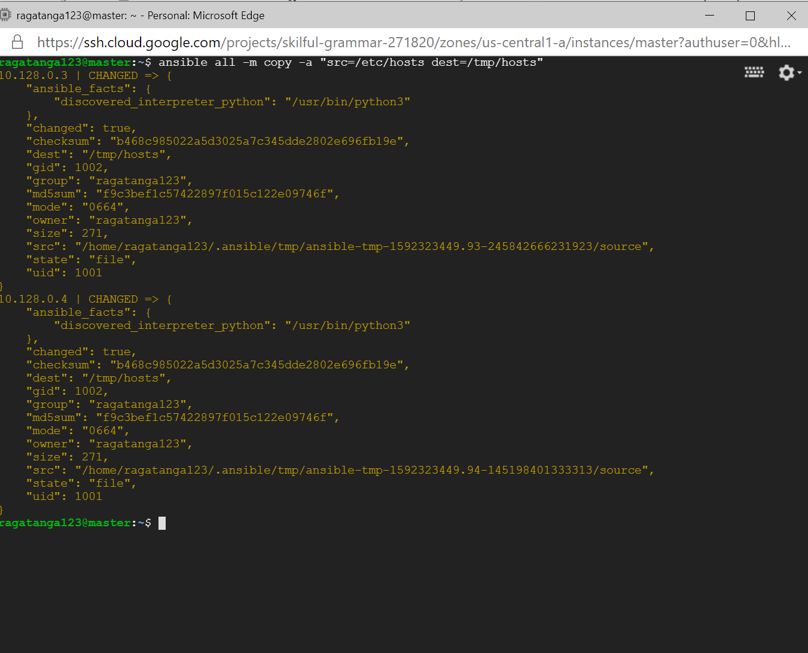


*Crear archivos y directorios*

El módulo file puede utilizarse para crear archivos y directorios, además de gestionar los permisos o crear enlaces simbólicos.

``` 
ansible all -m file -a "dest=/tmp/test mode=644 state=directory"
```
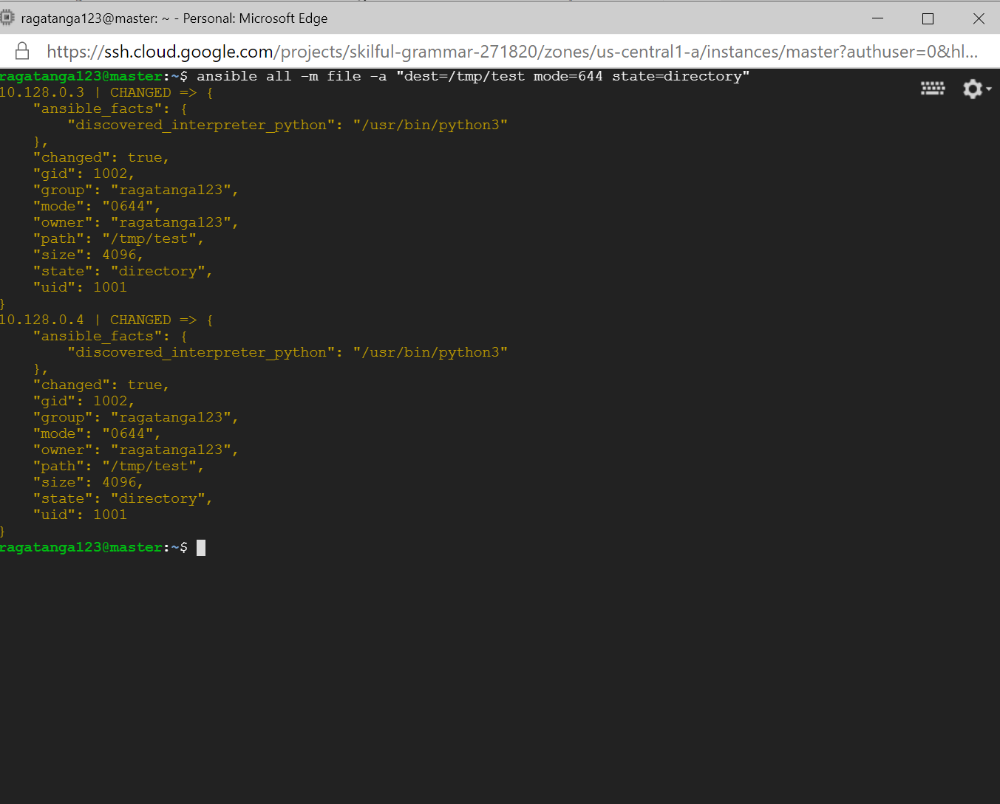

*Eliminar archivos y directorios*

Para eliminar un archivo o directorio simplemente hay que establecer su estado a absent.

```
ansible all -m file -a "dest=/tmp/file state=absent"
```
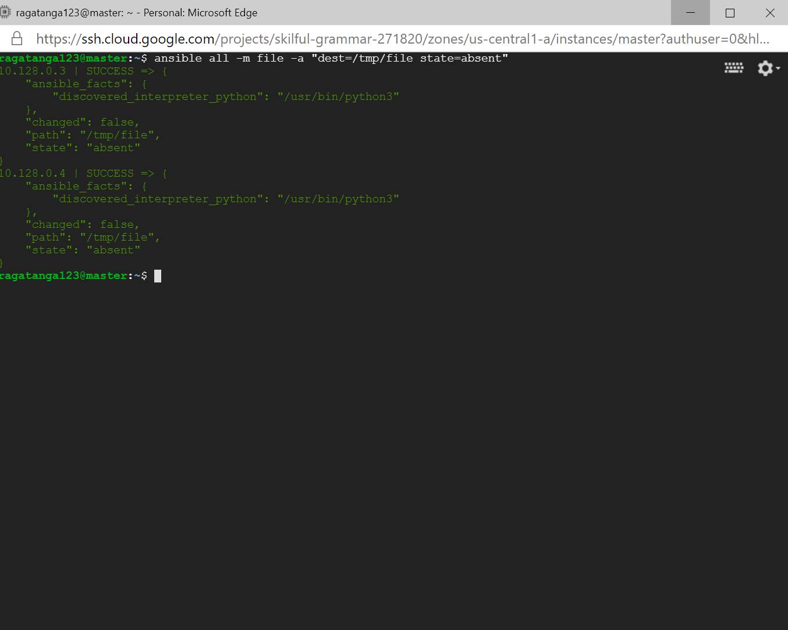

*Crones*

Las tareas periódicas que se ejecutan mediante un cron se gestionan mediante el crontab del sistema. Lo normal en estos casos es ejecutar crontab -e para editar los crones, pero con el módulo de crones de Ansible, la gestión de los mismos es muy sencilla.

Para ejecutar un script todos los días a las 4 de la madrugada:

```
ansible all -m cron -a "name='my-cron' hour=4 job='/script.sh'"
```


##	Ansible Playbooks 📄

Un Playbook es un archivo escrito en YAML donde se describen las tareas de configuración y administración que queremos realizar en cada uno de los nodos.

Un Playbook está formado por uno a varios Plays y un Play está formado por un conjunto de operaciones que vamos a realizar en un nodo.

**Estructura de un Playbook**

Es posible orquestar muchas máquinas al mismo tiempo con los plays de Ansible gracias a la agrupación de los nodos en los inventarios de Ansible.

Con estos comandos podríamos instalar un servidor Apache en cada nodo:
```
sudo apt-get install apache2
sudo service apache2 start
```
Con este playbook de Ansible lo haríamos de forma paralela en ambos nodos:
```
- hosts: all
 become: yes
 tasks:
 - name: Install Apache is at the latest version
 apt: name=apache2 state=latest
 - name: Ensure apache is running
 service: name=apache2 state=started enabled=yes

```
Podemos ejecutar el playbook anterior con:
```
ansible-playbook playbook.yaml
```

**Lista de Tareas**

Cada play contiene una lista de tareas, las cuales se ejecutan en orden y solo una al mismo tiempo. 
Es importante saber que el orden de las tareas es el mismo para todos los nodos. 

Si falla una tarea, se puede volver a ejecutar, ya que los módulos deben ser idempotentes, es decir, que ejecutar un módulo varias veces debe tener el mismo resultado que si se ejecuta una vez.

Todas las tareas deben tener un name, el objetivo es que la persona que ejecute Ansible pueda leer con facilidad la ejecución del playbook.
Las tareas se declaran en el formato module: options.
Por ejemplo:

```
- hosts: all
 become: yes
 tasks:
 - name: Ensure apache is running
 service: name=apache2 state=started enabled=yes
```

**Handlers**

Tal y como se ha mencionado anteriormente, los módulos deben ser idempotentes y pueden realizar cambios en los servidores donde se ejecuten.
Ansible reconoce dichos cambios y tiene un sistema de eventos que se puede utilizar para gestionar el resultado de una acción.

Estas acciones de notificación son lanzadas al final de cada bloque de tareas en un play y solo se ejecutarán una vez incluso si se llaman desde diferentes tareas.

Por ejemplo, cuando cambiemos un archivo de configuración podríamos reiniciar Apache, pero si Ansible detecta que lo vamos a reiniciar más de una vez, lo reinicia una única vez.

Con todo esto el contenido del archivo de ejemplo apache.yml podría ser:

```
---  
- hosts: googlehosts 
  become: yes 
  tasks: 
    - name: Install apache2 
      apt: name=apache2 update_cache=yes state=latest 

    - name: Enable mod_rewrite 
      apache2_module: name=rewrite state=present 
      notify: 
        - Restart apache2

  handlers: 
    - name: Restart apache2
      service: name=apache2 state=restarted
```

Para ejecutar el paybook usamos el siguiente comando:

```
ansible-playbook apache.yml
```

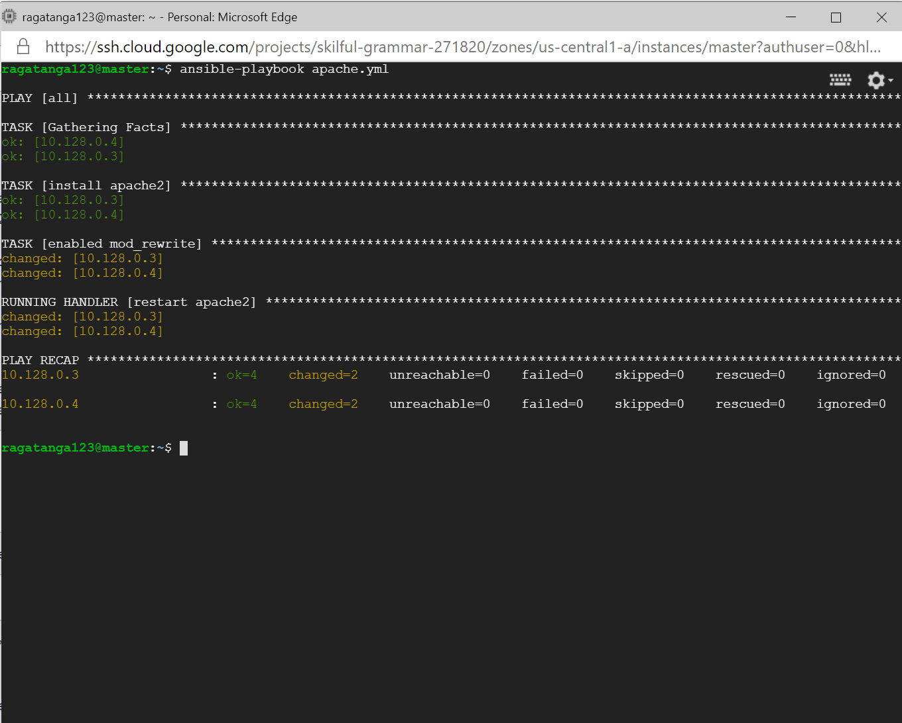


**Includes**

Aunque es posible escribir un playbook en un archivo muy largo, lo habitual es tratar de reutilizar partes del proyecto Ansible y tener todo organizado. En su nivel más básico, incluir archivos con tareas nos permite dividir grandes archivos de configuración en otros más pequeños.
Incluso un playbook puede ser incluido en otro playbook utilizando la misma sintaxis de include.

**Roles**

Ahora que ya sabemos lo que es una tarea, un handler o un include, sabemos que un proyecto en Ansible puede ser organizado para que sea mantenible. 
Cuando nuestra aplicación crece y hacemos includes, podemos llegar a transformar la aplicación en algo ilegible porque tendríamos un include dentro de otro infinitamente. Aquí surgen los roles, que son “paquetes” de configuraciones bien organizados que pueden reutilizarse en cualquier host.


---
___


# __**Instalación de la pila LAMP mediante Ansible**__ 

Para la instalación de la pila LAMP en los diferentes nodos mediante Ansible vamos a seguir los siguientes pasos:

1. Tener configurados nuestros nodos como hemos visto anteriormente.

2. Configurar nuestro archivo de inventario que se encuentra en /etc/ansible/hosts. Creamos un grupo llamado nodos que contendrá las IPs de los diferentes nodos.

 ```
[nodos]
10.128.0.7
10.128.0.8
```

3. En nuestro nodo máster creamos una carpeta para nuestro proyecto, y dentro, otra carpeta llamada roles que contendrá los playbooks necesarios para el despliegue.

4. El primer playbooks que crearemos será el de apache.yml, con un contenido similar a éste:

```
---
- hosts: nodos
  become: yes
  tasks:
    - name: Install apache2
      apt: name=apache2 update_cache=yes state=latest
    - name: Enable mod_rewrite
      apache2_module: name=rewrite state=present
      notify:
        - Restart apache2
  handlers:
    - name: Restart apache2
      service: name=apache2 state=restarted

```
5. A continuación creamos el playbook de mysql.yml con el siguiente contenido:

```
- name: Install MySQL for production ready server
  become: yes
  hosts: nodos
  vars:
    MySQL_root_pass: root
  tasks:
    - name: Set MySQL root password before installing
      debconf: name="mysql-server" question="mysql-server/root_password" value="{{MySQL_root_pass | quote}}" vtype=$
    - name: Confirm MySQL root password before installing
      debconf: name="mysql-server" question="mysql-server/root_password_again" value="{{MySQL_root_pass | quote}}" $
    - name: test1
      apt: package={{ item }} state=present force=yes update_cache=yes cache_valid_time=3600
      with_items:
        - mysql-server
        - mysql-client
        - python-mysqldb
    - name: Deletes anonymous MySQL server user for localhost
      mysql_user: user="" state="absent" login_password="{{ MySQL_root_pass }}" login_user=root
    - name: Secures the MySQL root user
      mysql_user: user="root" password="{{ MySQL_root_pass }}" host="{{ item }}" login_password="{{MySQL_root_pass}$
      with_items:
        - 127.0.0.1
        - localhost
        - ::1
        - "{{ ansible_fqdn }}"
    - name: Removes the MySQL test database
      mysql_db: db=test state=absent login_password="{{ MySQL_root_pass }}" login_user=root

```

6. Por último vamos a crear el playbook el cual vamos a desplegar que se llamará lamp.yml con el siguiente contenido:

> **Buena Praxis**  
> El archivo lamp.yml contiene a su vez a los otros playbooks gracias al sistema de includes.Sin este sistema tendríamos un playbook muy extenso y demasiado lioso a medidad que aumentamos código, por eso utilizamos este método que es mucho mas curioso y sostenible en el tiempo:

```
---

- name: install LAMP Stack
  become: yes
  hosts: nodos
  become: true
  gather_facts: true

- name: Include Apache
  import_playbook: apache.yml

- name: Include MySQL
  import_playbook: mysql.yml

```

7. Para desplegar el playbook de ansible lo hacemos mediante el siguiente comando:

```
ansible-playbook lamp.yml
```

Si todo va como debería obtendríamos un resultado similar a la imagen:

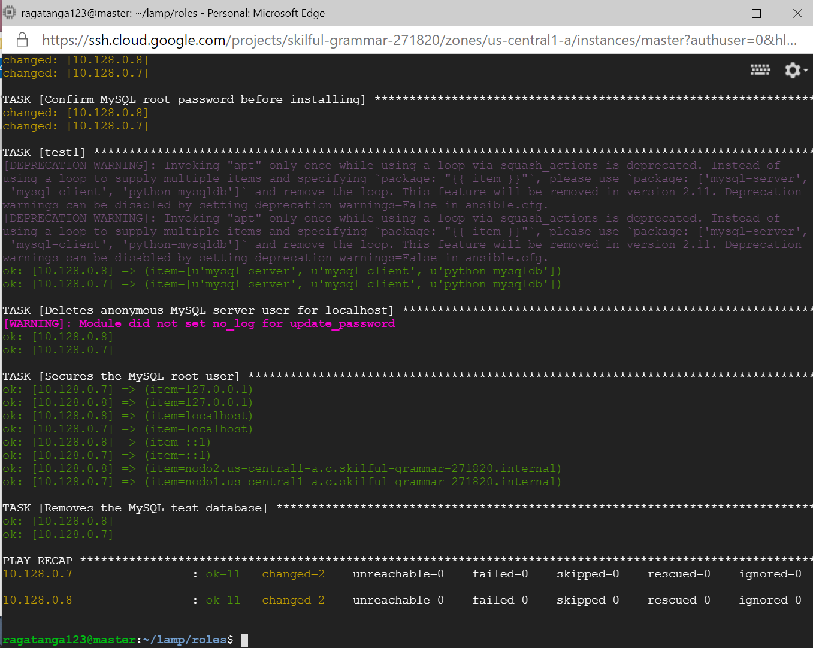


___
---

## Referencias 🧩

[Jose Juan Sanchez](https://josejuansanchez.org/taller-ansible-aws// "JJ the best")

[Videotutorial de Ansible de makigas.es](https://www.makigas.es/series/ansible/ "")

[Curso de Ansible de ualmtorres](https://ualmtorres.github.io/CursoAnsible/tutorial/ "")

[Taller de Ansible](https://github.com/iesgn/talleres_asir_iesgn/blob/master/ansible/ansible.md "")

[Ansible Oficial](https://www.ansible.com "")